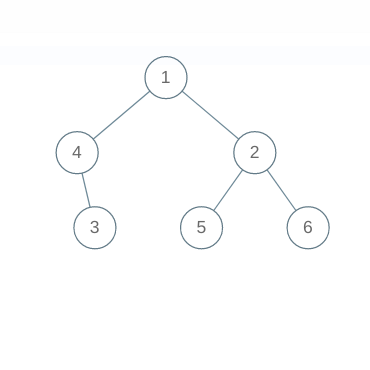

# Collect Target

**Difficulty: Medium**

The space station is designed in a way such that each path diverges further into either 2 paths, 1 path or no paths at all. The topmost navigation center acts as the root, which means that the root is not diverged from any path but is the origin. The bottom-most reactor acts as the leaf which means that it will have no path from there. The divergence follows hierarchy. Each path consists of certain number of coins and the space general has asked you to collect exactly X coins but has also specified that you must follow the hierarchy. He has also specified that the coins collected must be from root to leaf. Find out if it is possible to collect exactly X coins.

## Example Input

**X=8**

## Example Output

**True**

## Explanation

There are 2 possible ways to attain 8, (1 -> 4 -> 3) and (1 -> 2 -> 5). Note that in both cases, the coins are collected from root till leaf.
