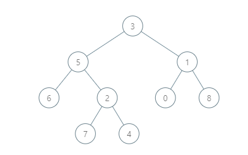

# Common Boss

**Difficulty: Medium**

The Space Station needs a lot of employers to function properly. The recruiting system is based on hierarchy, just like in real life. Every boss has either 0 or 1 or 2 employees working directly under them. They are all denoted by their id numbers.  
The Space Commander gives you 2 ids, X and Y and he wants to know their common boss at the lowest level.

## Input

- The first line of input contains a single integer T. T lines follow
- Two space separated integers, X and Y, belonging to the binary tree.

## Example Input

**2**  
**6 2**  
**5 0**

## Example Output

**5**  
**3**

## Explanation

- Test Case 1: 6 and 2 branch from 5, which is the id of their immediate common boss.
