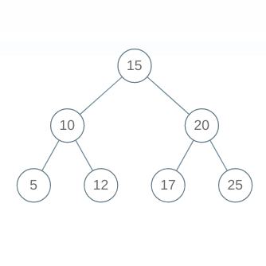

# Cousins

**Difficulty: Medium**

Turns out the crewmates involved in the Space Mission are actually a big family! CoochieMan, one of the crewmates decided to draw a family tree. The family tree depicted that each member of the family has either 0 or 1 or 2 children. They are depicted by ther initials and you can be sure that all the initials in a particular family tree are unique.  
Id no of 2 crewmates, X and Y has been given. The Space Mission General wants to know if both of them are cousins or not.  
2 crewmates are cousins when they don't share the same parent and belong to the same genration(equal height from top).

## Input

- The first line of input contains a single integer T. T lines follow
- Two space generated integers, X and Y, belonging to the binary tree.

## Example Input

**2**  
**10 20**  
**5 17**

## Example Output

**False**  
**True**

## Explanation

In test case 1, 10 and 20 are not cousins because even though they belong to the same genration, they share the same parent.  
In the test case 2, 5 and 17 are cousins because they belong to the same generation and have different parents.
