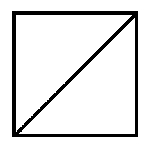
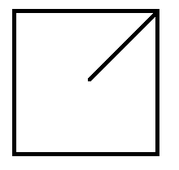
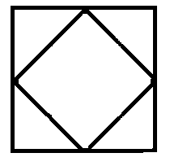
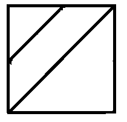

# Crewmate, Impostor, No-one

**Difficulty: Hard**

The space station is in the shape of an NXN square, composed of blocks of size 1x1. Each 1X1 has either a crewmate, denoted by a '/' , or an impostor, denoted by a '\' , or no one. Each of these characters divide the block into contiguous regions.  
The space general wants to know the number of regions the space station can be divide in.
**Note- backslash characters are escaped, so a '\' is represented as '\\'**

## Input

- The first line of the input contains a single integer T denoting the number of test cases T. T test cases follow
- The first line of each test case contains a single integer N
- The next N line contains a string of length N with only 3 characters, '/' or '\\' or a blank.

## Output

- For each test case, print the number of regions formed

## Example Input

5  
2  
" /"  
"/ "  
2  
" /"  
" "  
2  
"\\/"  
"/\\"  
2  
"/\\"  
"\\/"  
2  
"//"  
"/ "

## Example Output

2  
1  
4  
5  
3

## Explanation

The grid for the test cases is as follows:

- Test Case 1:
  
- Test Case 2:
  
- Test Case 3:
  
- Test Case 4:
  
- Test Case 5:
  
