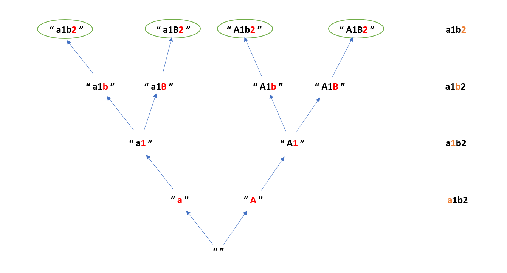

# Case Game

[Problem](https://github.com/dscnsec/DSC-NSEC-Algorithms/blob/master/8.%20Backtracking/case_game/case_game.md)  
[Source code](https://github.com/dscnsec/DSC-NSEC-Algorithms/blob/master/8.%20Backtracking/case_game/%5BCPP%5Dcase_game_csubhradipta.cpp)

## Explanation

Here, our task is to print the combinations of string formed after transforming every character to lowercase and uppercase case.

At first we will take a string `curr` to store and print our results.

Now check individual character of the original string-
- If the character is a digit, then append it to `curr` as it is.
- Else append uppercase and lowercase of that character separately one by one to `curr`.

When the length of `curr` string becomes equal to the length of original string, return the `curr` string.


```cpp
void transform(string org, string curr, int i){
    if(curr.size() == org.size()){
        cout<<curr<<endl;
        return;
    }
    
    if(isdigit(org[i]))
        transform(org, curr + org[i], i+1);
        
    else {
        transform(org, curr + char( tolower(org[i]) ), i+1);
        transform(org, curr + char( toupper(org[i]) ), i+1);
    }
    return;
}
```

For example, if a string is given "a1b2", then - 



## Space & Time complexities

Space Complexity:  O(n)  
Auxiliary Space : &emsp; O(n)  
Time Complexity:  O(2<sup>n</sup>)