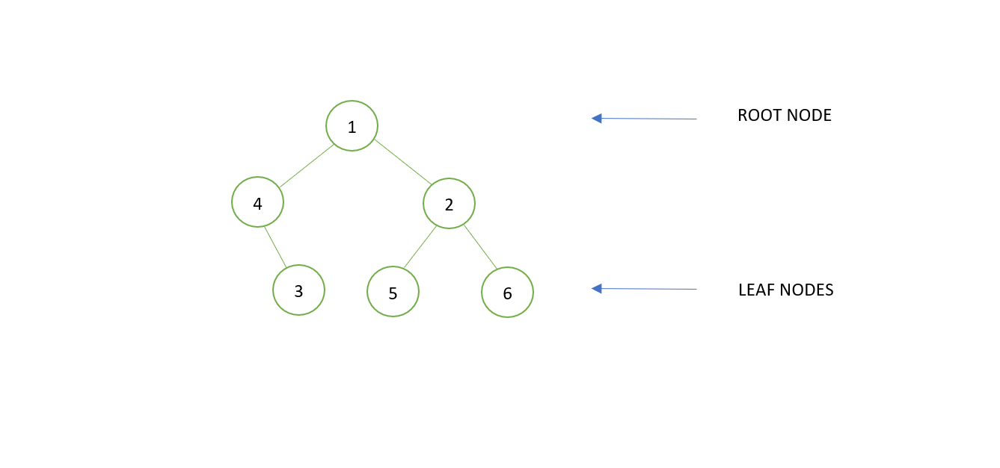
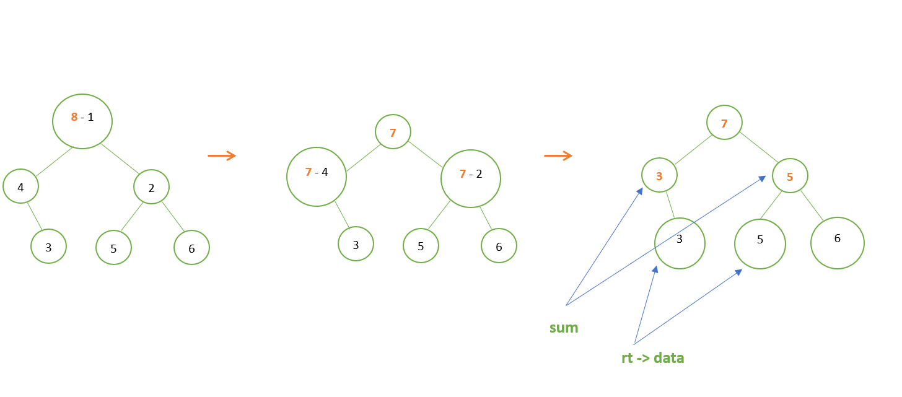

# Collect Target

[Problem](https://github.com/dscnsec/DSC-NSEC-Algorithms/blob/master/6.%20Binary%20Tree/collect_target/collect_target.md)  
[Source code](https://github.com/dscnsec/DSC-NSEC-Algorithms/blob/master/6.%20Binary%20Tree/collect_target/%5BCPP%5Dcollect_target_csubhradipta.cpp)

## Explanation

Here, our task is to check whether or not the given sum is equal to the sum of any root to leaf path of a binary tree.

Suppose, a tree is given and sum is given as **8** -

So, we will traverse the tree from root to leaf nodes and sum with ``sum - node value``.

When we reach to leaf, we will check that if the sum is equal to the leaf node or not. If it is, then return true.

If our control reaches to NULL, that means, the sum of nodes of that particular path is not equal to the given sum.
So, in that case, we will return false.  

Here, we are getting two of such path, so our answer is true.

## Space & Time complexities

Space Complexity:  O(n)  
Time Complexity:  O(n)