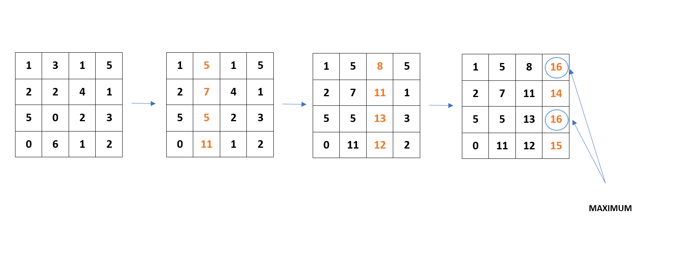

# Cookie Collect

[Problem](https://github.com/dscnsec/DSC-NSEC-Algorithms/blob/master/7.%20Dynamic%20Programming/cookie_collect/cookie_collect.md)  
[Source code](https://github.com/dscnsec/DSC-NSEC-Algorithms/blob/master/7.%20Dynamic%20Programming/cookie_collect/%5BCPP%5Dcookie_collect_csubhradipta.cpp)

## Explanation

Here, our task is to find maximum number obtained from matrix from left to right.

We are allowed to move right-up, right or right-down.  

For example, a matrix is given - 


```
1 3 1 5
2 2 4 1
5 0 2 3
0 6 1 2
```

So, we will traverse the matrix from 2<sup>nd</sup> column onwards and update each cell by adding the maximum value among left-up, left and left-down cells of previous column to it, and we end up getting some of the numbers in the cells of last column.



And the maximum of the last column is our required answer i.e. `16`.


## Space & Time complexities

Space Complexity:  O(n<sup>2</sup>)  
Time Complexity:  O(n<sup>2</sup>)