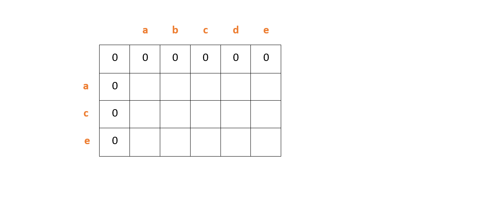
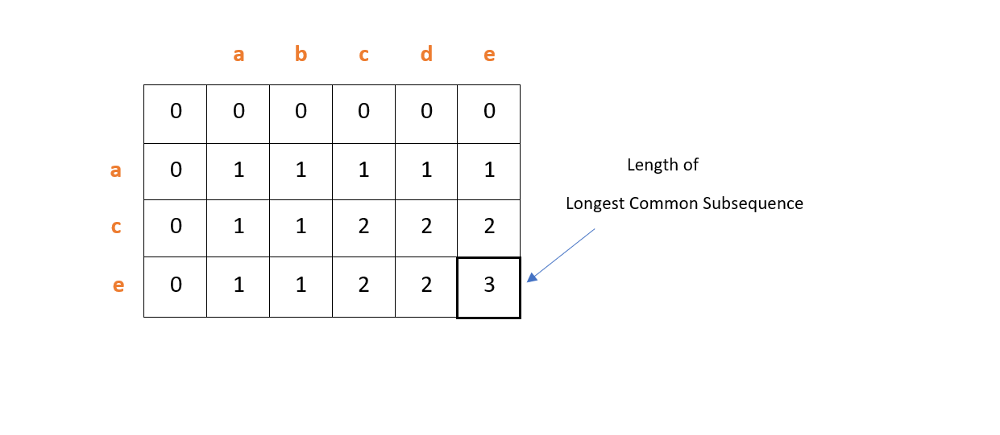

# Lucky Pairs

[Problem](https://github.com/dscnsec/DSC-NSEC-Algorithms/blob/master/7.%20Dynamic%20Programming/lucky_pairs/lucky_pairs.md)  
[Source code](https://github.com/dscnsec/DSC-NSEC-Algorithms/blob/master/7.%20Dynamic%20Programming/lucky_pairs/%5BCPP%5Dlucky_pairs_csubhradipta.cpp)

## Explanation

Here, our task is to check whether or not the length of the longest common subsequence of two string is greater than the half on length of the larger string.  

Suppose, two strings are given - 
`abcde ace`

Let length of the strings be `m` &amp; `n` . 
 
At first, we will create a matrix of size (n + 1) × (m + 1) and initialize the topmost row and leftmost column with zeroes.

Then, we will fill the matrix in following way-
- If a character is matching in corresponding row and column, fill the cell with the value of up-left cell plus 1.
- Else, set the cell with maximum value among previous cell of row and column.

So, we got the length of longest common subsequence, i.e. the value of last cell of the matrix. Here, it is 3.

Now, we'll check whether the length we got is greater than the half of the larger string. If true, print "YES", else "NO".  
Here, the length of larger string is 5. So, its length is greater than half the length of `abcde` (3 > 2.5). Therefore, print "YES".

## Space & Time complexities

Space Complexity:  O(n)  
Time Complexity:  O(n × m)