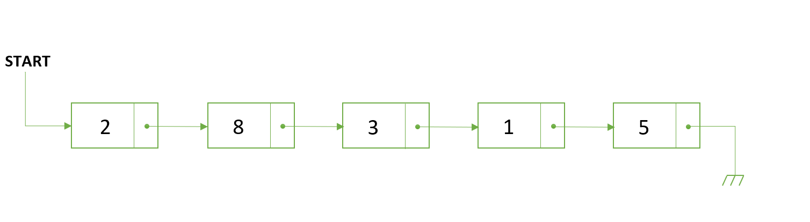
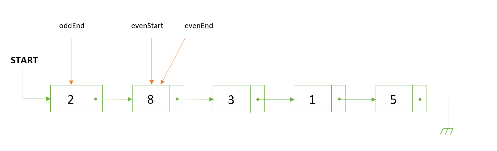
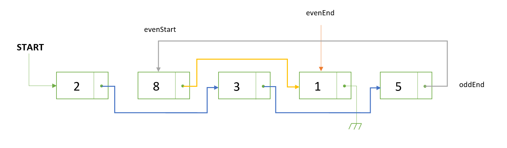
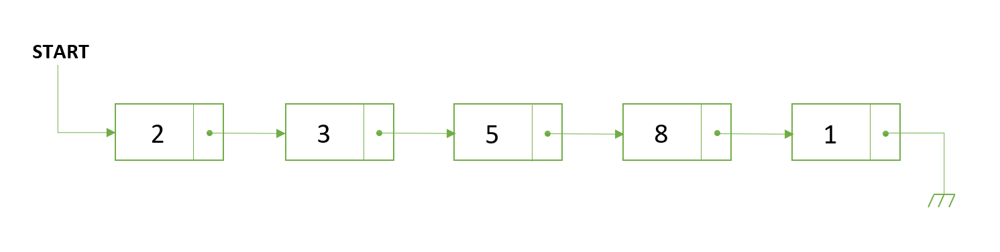

# Grouping
[Problem](https://github.com/dscnsec/DSC-NSEC-Algorithms/blob/master/5.%20Linked%20List/grouping/grouping.md)  
[Source code](https://github.com/dscnsec/DSC-NSEC-Algorithms/blob/master/5.%20Linked%20List/grouping/%5BCPP%5Dgrouping_csubhradipta.cpp)  
## Explanation
Here, our task is to goup the odd nodes and even nodes in a given linked list.

Suppose, a linked list is given as
``2 -> 8 -> 3 -> 1 -> 5``

So, at first, we'll take 3 node pointers-  
 - ``oddEnd`` - hold the last odd node of the list
 - ``evenStart``  - hold the first even node of the list
 -  ``evenEnd`` - hold the last even node of the list

After it, initialize these pointers - 
- ``oddEnd = start``   
- ``evenStart = start->next``    
-  ``evenEnd = evenStart``   



Now, we will group the odd nodes and even nodes simultaneously until the oddEnd and evenEnd reach to NULL.
```cpp
while((evenEnd != NULL) && (oddEnd != NULL) && (evenEnd->next != NULL)){

	oddEnd->next = evenEnd->next;       //  pointing to next odd node
	oddEnd = evenEnd->next;             //  set oddEnd to next odd node
	evenEnd->next = oddEnd->next;       //  pointing to next even node
	evenEnd = evenEnd->next;            //  set evenEnd to next even node
}
```
Once the grouping is done, simply link the oddEnd to evenStart.  
The actual thing after these operations will somewhat look like this -  

So, our final linked list is -  


 ## Space & Time complexities
Space Complexity: &emsp;O(n) 
Time &nbsp;Complexity: &emsp;O(n)

