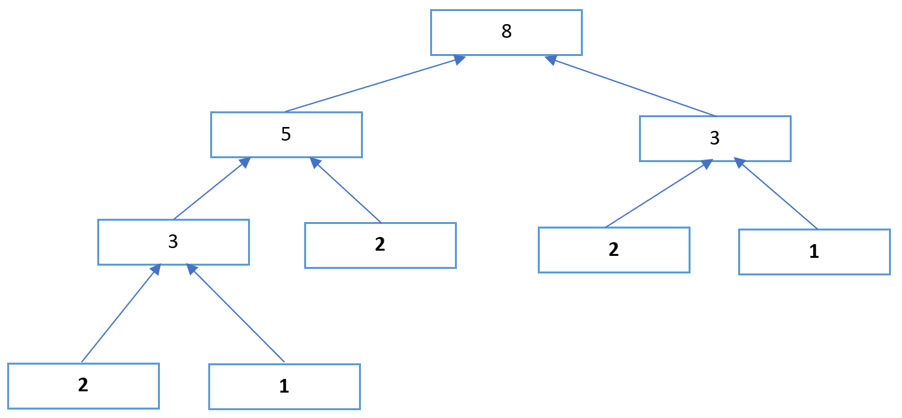

# Climb Stairs
[Problem](https://github.com/dscnsec/DSC-NSEC-Algorithms/blob/master/3.%20Recursion/climb_stairs/climb_stairs.md)  
[Source code](https://github.com/dscnsec/DSC-NSEC-Algorithms/blob/master/3.%20Recursion/climb_stairs/%5BCPP%5Dclimb_stairs_csubhradipta.cpp)  
## Explanation
Here, our task is to find number of ways to climb stairs using 1 or 2 steps. 

So, this is done using recursion-
```cpp
int stairWays(int n){
	if (n == 1 or n == 2)	// base case
		return n;
	else					// recursive part
		return stairWays(n-1) + stairWays(n-2);	
}
```

When user gives 1 or 2 as input, we can simply return the value itself as its the only possible ways to climb the stairs, else we will make a recursive call to the function till the control reaches the base case.

Lets see how it works -

Suppose, for n = 5

The recursion tree will look like -
  
 
Once the base case attained, it will start returning the values for the individual calls and reach to the root and return the value.

   

So, for ``n = 5`` , **8** will be returned, i.e. the number of possible ways to climb the stairs of 5 steps.  

## Space & Time complexities
Space Complexity: &emsp;O(1)  
Time &nbsp;Complexity: &emsp;O(2<sup>n</sup>)

