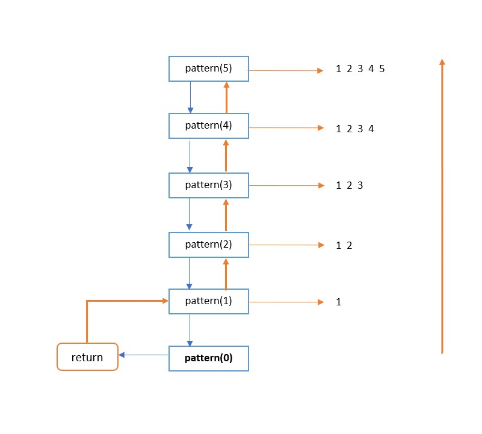

# Pattern
[Problem](https://github.com/dscnsec/DSC-NSEC-Algorithms/blob/master/3.%20Recursion/pattern/pattern.md)  
[Source code](https://github.com/dscnsec/DSC-NSEC-Algorithms/blob/master/3.%20Recursion/pattern/%5BCPP%5Dpattern_csubhradipta.cpp)  
## Explanation
Here, our task is to print the following pattern (for n = 5) using recursion.

```
 1  
 1 2
 1 2 3
 1 2 3 4
 1 2 3 4 5
```

As it's mentioned, we've to print the given pattern using recursion, so we will implement the following-
```cpp
void pattern(int n)
{
    int i;
    if(n == 0)		// base case
        return;
    else
    {   
        pattern(n-1);		// recursive call
        for(i=1; i <= n; i++)	// pattern line from 1 to n
            cout<<i<<" ";
        cout<<endl;
    }
}
```

Lets see how the above code works -


 
Here, our base case is ``if( n == 0) return;`` . So, the recursive calls will be made by passing the previous value (n-1) until t reaches to 0.
Once it reaches 0, then the function returns and each line will be printed.

Therefore, for ``n = 5`` , our pattern will be  
  
```
 1  
 1 2
 1 2 3
 1 2 3 4
 1 2 3 4 5
```


## Space & Time complexities
Space Complexity: &emsp;O(1)  
Time &nbsp;Complexity: &emsp;O(n<sup>2</sup>)

