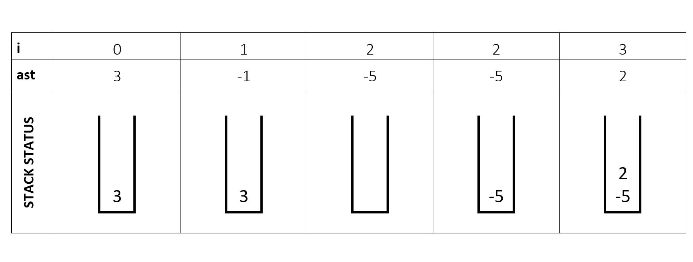

# Destroy Asteroid
[Problem](https://github.com/dscnsec/DSC-NSEC-Algorithms/blob/master/4.%20Stack/destroy_asteroid/destroy_asteroid.md)   
[Source code](https://github.com/dscnsec/DSC-NSEC-Algorithms/blob/master/4.%20Stack/destroy_asteroid/%5BCPP%5Ddestroy_asteroid_csubhradipta.cpp)    
## Explanation
Here, we have to find out the state of asteroids after all collisions.

It's simple that if two asteroid moving towards each other, they will collide and the smaller one (or both if size are same) will be destroyed.

So, our approach will be - 

 - If an asteroid is greater than zero, push it into the stack.
 - Else  	 
     - If stack is empty or the top element of the stack is less than zero, then push asteroid into the stack.
     - Else if absolute value of top element of stack and absolute value of asteroid are equal, then pop the element.
     - Else if absolute value of top element is less than the absolute value of asteroid, then pop the elements from stack until a higher value is being found.

Let's see an example -

``3 -1 -5 2``		&emsp;&emsp;(n=4)

Now, we will store the final stack result into an array and reverse it.  
So, our answer is  
``-5 2``
 
## Space & Time complexities
Space Complexity: &emsp;O(n)  
Auxiliary space: O(n)  
Time &nbsp;Complexity: &emsp;O(n)

